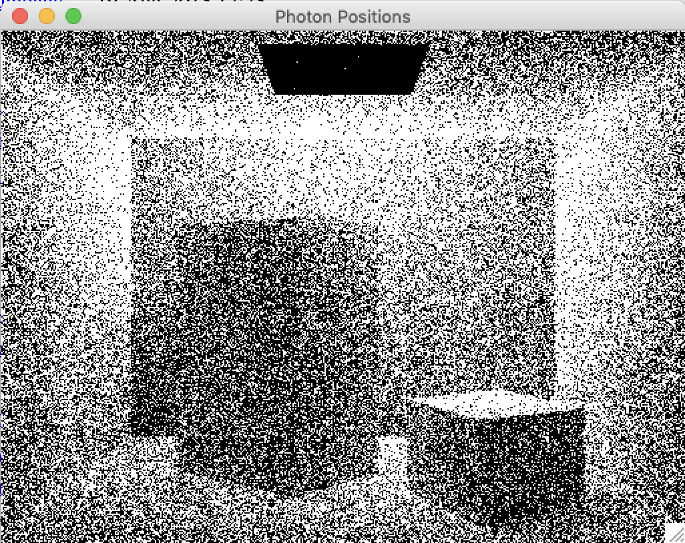

[](https://opensource.org/licenses/MIT)

# PhotonTracer: Experimental Global Illumination Renderer

This is a hobby project in C# that I worked on between 2006 and 2009 derived on Java code I did back in my university days.

It's basically a classic photon mapping implementation and a global illumination renderer done pretty much as
described in Henrik Wann Jensen's book. The renderer basically runs in 3 stages:

1. Photon emission
2. Rendering an approximate solution
3. Rendering the final, accurate solution

The implementation does support multiple cores and produces nicely anti-aliased images like the one below. Stuff like texture mapping,
bump mapping, and caustics rendering are supported, as well. There's also a half-baked attempt to do irradiance caching which was never
completed. Debugging all the edge cases right turned out to be really challenging and I turned my attention to other projects.

There's no scene input file format or anything fancy like that. Changing the scene requires changing the code.

A final rendering of the classic Cornell box:


A window shows the absorbed photon locations:



# Building

Clone the repository and execute Maven from the root directory:

    $ git clone https://github.com/jonfryd/PhotonTracer
    $ cd PhotonTracer/
    $ ./build.sh

This is for Linux or Mac OS X. For Windows run .bat-file:

    $ build.bat

# Usage

After building, run ```Photontracer.exe``` on Mac OS X using Mono (64-bit is not yet supported):

    $ mono32 Photontracer.exe

In Linux using Mono:

    $ mono Photontracer.exe

Windows users are able to run the .exe directly, of course.

After the program finishes all its number crunching, a JPEG image called ```photontraced.jpg``` is produced.
Cheers!

# Warning

The code is a bit of a mess and I never bothered cleaning up the ```_Renamed_Field``` suffixes that
were added when converting the original Java code to C#. Some day...

# Author

This application created by Jon Frydensbjerg - email: jonf@elixlogic.com
