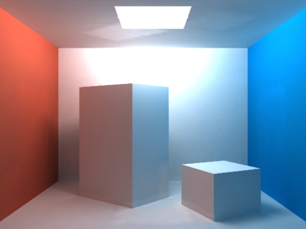

[](https://opensource.org/licenses/MIT)

# PhotonTracer: Experimental Global Illumination Renderer

This is a hobby project in C# that I worked on between 2006 and 2009 derived on Java code I did back in my university days.

It's basically a classic photon mapping implementation and a global illumination renderer done pretty much as
described in Henrik Wann Jensen's book. The renderer basically runs in 3 stages:

1. Photon emission
2. Rendering an approximate solution
3. Rendering the final, accurate solution

The implementation does use multiple cores and produces nicely anti-aliased images. Caustics are supported, as well.
There's also a half-baked attempt to do irradiance caching which was never completely done AFAIR - debugging all
the edge cases right turned out to be rather challenging.

An example rendering of the classic Cornell box:



A window shows the absorbed photon locations:


# Building

Clone the repository and execute Maven from the root directory:

    $ git clone https://github.com/jonfryd/ImageClustering
    $ cd ImageClustering/
    $ ./build.sh

This is for Linux or Mac OS X. For Windows run .bat-file:

    $ build.bat

# Usage

After building, run ```Photontracer.exe``` on Mac OS X using Mono (64-bit not supported it seems):

    $ mono32 Photontracer.exe

In Linux using Mono:

    $ mono Photontracer.exe

Windows users are able to run the .exe directly, of course.

Ater finishing all the number crunching, the renderer outputs a JPEG image called ```photontraced.jpg```.

# Author

This application created by Jon Frydensbjerg - email: jonf@elixlogic.com
